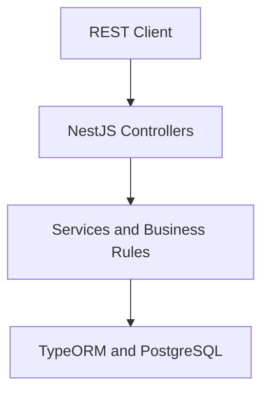

# TechHelpDesk API

A role-based REST API for managing the complete lifecycle of technical support tickets.

Built with NestJS, TypeORM, and PostgreSQL, the project demonstrates modular backend architecture, authentication, authorization, data validation, database migrations, API documentation, and automated testing.

## Core capabilities

- JWT authentication with access and refresh tokens.
- Role-based authorization for administrators, technicians, and clients.
- Complete ticket lifecycle management.
- Technician assignment and workload validation.
- PostgreSQL persistence through TypeORM.
- Database migrations and reproducible seed data.
- Interactive OpenAPI documentation with Swagger.
- Docker-based local environment.

## Business rules

- Tickets move through an enforced sequence: `Open → In Progress → Resolved → Closed`.
- A technician can have no more than five tickets in progress.
- A ticket can only be created for an existing client and category.
- Clients can view their own ticket history.
- Technicians can only manage tickets assigned to them.
- Administrative operations are protected by role-based authorization.

## Architecture



## Technology stack

| Area | Technologies |
| --- | --- |
| Backend | NestJS 10, TypeScript, Node.js |
| Database | PostgreSQL, TypeORM |
| Security | JWT, Passport, bcrypt, role-based guards |
| Validation | class-validator, class-transformer |
| Documentation | Swagger / OpenAPI |
| Testing | Jest, ts-jest |
| Infrastructure | Docker, Docker Compose |

## Main API resources

- `POST /auth/register`
- `POST /auth/login`
- `POST /auth/refresh`
- `/users`
- `/categories`
- `/technicians`
- `/clients`
- `/tickets`

Detailed request and response examples are available at `http://localhost:3000/docs` after starting the application.

## Run with Docker

### Prerequisites

- Docker Desktop
- Docker Compose

Start the database:

```bash
docker compose up -d db
```

Start the API:

```bash
docker compose up -d api
```

View API logs:

```bash
docker compose logs -f api
```

The API runs at `http://localhost:3000` and Swagger is available at `http://localhost:3000/docs`.

## Run locally

### Prerequisites

- Node.js 18 or later
- npm
- PostgreSQL

```bash
npm install
DB_HOST=localhost npm run db:migrate
DB_HOST=localhost npm run seed
npm run start:dev
```

## Development credentials

The repository includes seed users exclusively for local development and demonstration:

| Role | Email | Password |
| --- | --- | --- |
| Administrator | `admin@techhelpdesk.com` | `admin123` |
| Technician | `tech@techhelpdesk.com` | `tech123` |
| Client | `client@techhelpdesk.com` | `client123` |

These credentials must never be used in a production environment.

## Testing

```bash
# Run the test suite
npm run test

# Generate a coverage report
npm run test:cov
```

## Author

**Luis David Ducuara Cadavid**  
Backend & Automation Developer · Mechatronics Engineering Student  
[GitHub](https://github.com/LuisDa87) · [LinkedIn](https://www.linkedin.com/in/luisdavidd/)
